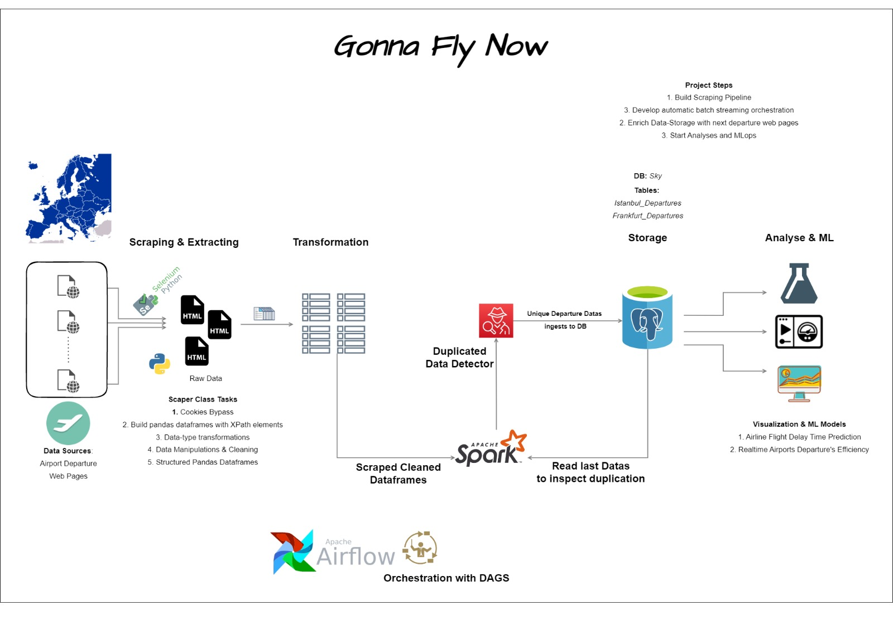

# Project Schema

Project aim is to present real-time delay times of airports of europe-cities for delay-time forecasting machine learning project. In order to do that, firstly the departure tables is being scraped from web-pages of theirs, 
then being applied kinds of data transformations and manipulations to load structured data tables in to postgresql database. During this process, the tools are using for these reasons:

**Python libraries:**
1. Selenium : Scraping data tables with chromedriver from web pages
2. Shadow: Bypassing cookies of web pages
3. Pandas: Obtaining dataframes from HTML elements and transforming datas
4. Apache Spark: Bridge between postgresql tables and pandas dataframes in order to load them to database. Other mission is in order to avoid loading of duplicated data during every scraping. It is a pretty well sieve for this job.
5. Postgresql : to store structured data tables for each city departure. In the next step it will be source for ML part.
6. Apache airflow: Automizing of all scrapings as DAG.

Patch v.1.1: Frankfurt and Istanbul web pages has been scraping successfully.

# Installation

1. `git clone https://github.com/mcomak/web_scratching.git`

### flyenv virtual environment installation
2. `python3 -m pip install virtualenv`
3. `cd gonnaflynow/`
4. `python3 -m virtualenv flyenv`
5. `source flyenv/bin/activate`
6. `pip install -r requirements.txt`

# Required-Postgresql Commands

1. Check Status

`sudo systemctl status postgresql-10`

2. show tables: 

`\dt`

3. postgresql root & train user authorization:
`sudo -U postgres bash -c 'psql'`
`psql -U train -W -h localhost sky`

